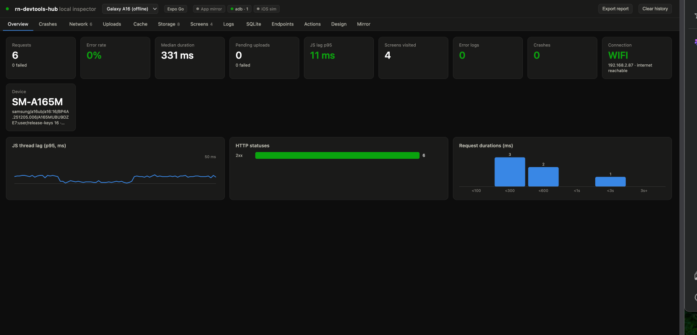
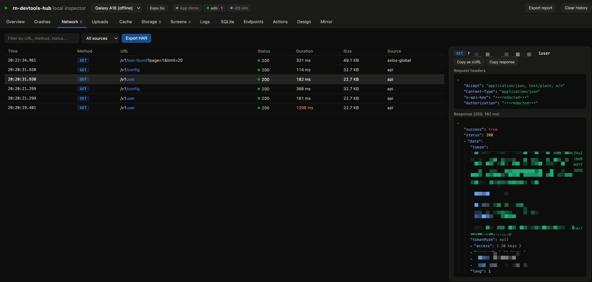
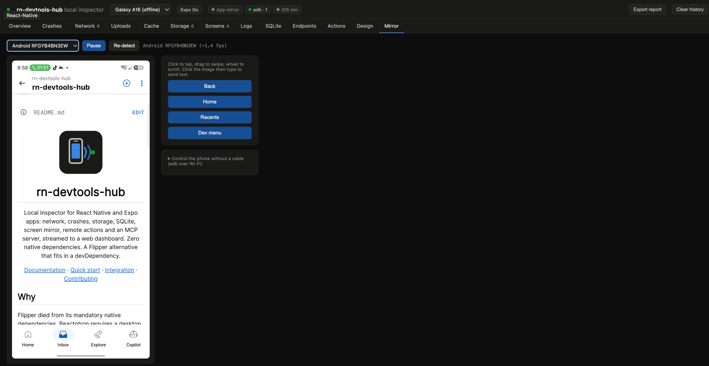
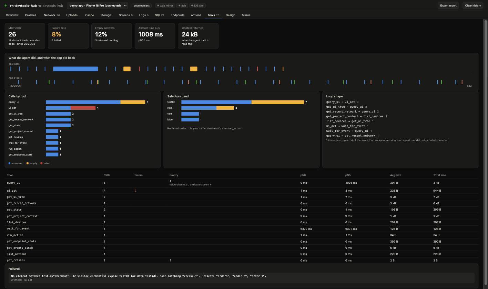

<p align="center">
  
</p>

<h1 align="center">rn-devtools-hub</h1>

<p align="center">
  The agent runtime for React Native. Your agent sees the app the way React
  sees it, knows which file produced each element, acts without coordinates,
  and proves that it works. Zero dependencies, everything stays on your
  machine.
</p>

<p align="center">
  <a href="https://rn-devtools-hub.github.io/rn-devtools-hub/">Documentation</a> ·
  <a href="#quick-start">Quick start</a> ·
  <a href="#integration-guide">Integration</a> ·
  <a href="#contributing">Contributing</a>
</p>

## Use it from an agent

Both plugins install the MCP server plus a skill that teaches the agent to
chain its tools: check the project context before debugging anything that
looks impossible, prove results with assertions instead of screenshots, wait
on events instead of sleeping, and read an element's source instead of
grepping the repository.

**Claude Code**

```
/plugin marketplace add rn-devtools-hub/rn-devtools-hub
/plugin install rn-devtools-hub
```

**Codex**

```
codex plugin marketplace add rn-devtools-hub/rn-devtools-hub
codex plugin add rn-devtools-hub
```

Then start the hub at the root of your app, which is what the agent talks
to:

```
npx rn-devtools-hub
```

Registering the server by hand works too. Claude Code:

```
claude mcp add rn-devtools --transport http http://127.0.0.1:8973/mcp
```

Codex, in `~/.codex/config.toml`:

```toml
[mcp_servers.rn-devtools]
url = "http://127.0.0.1:8973/mcp"
```

**Cursor** has no marketplace, so it is two files in your own project.
Declare the server in `.cursor/mcp.json`:

```json
{
  "mcpServers": {
    "rn-devtools": { "type": "http", "url": "http://127.0.0.1:8973/mcp" }
  }
}
```

And copy the rule, which is the Cursor equivalent of the skill:

```bash
mkdir -p .cursor/rules
cp node_modules/rn-devtools-hub/templates/cursor-rule.mdc \
   .cursor/rules/rn-devtools-hub.mdc
```

It ships with `alwaysApply: false`, so Cursor pulls it in when the task
matches instead of paying for it on every request.

For any other agent, the skill on its own comes from the
[skills.sh](https://skills.sh) registry:

```
npx skills add rn-devtools-hub/rn-devtools-hub
```

It writes `.agents/skills/rn-devtools-hub` and links it into whichever
agents it detects, from Gemini CLI and Copilot to Windsurf and Zed. This
installs the skill only, so register the server as above and start the hub
to give the agent something to talk to.

Any client that speaks only stdio uses `npx rn-devtools-hub mcp`, which
bridges to the hub and starts it on demand.

## Screenshots

<p align="center">
  
  <em>Overview: request counts, error rate, JS thread lag, connection and device at a glance</em>
</p>

<p align="center">
  
  <em>Network: colored methods, slow requests highlighted, foldable JSON, copy as cURL, secrets redacted before they leave the device</em>
</p>

<p align="center">
  
  <em>Mirror: the live device screen over adb, click to tap, drag to swipe, wheel to scroll, plus Back/Home/Recents/Dev menu</em>
</p>

<p align="center">
  
  <em>Tools: what the agent did and what the app did back, calls per tool split into answered / empty / failed, failures grouped by message, empty answers with the reason the tool gave, and the context each answer bills the agent</em>
</p>

## Why

The SDK lives **inside the JavaScript runtime of your app**.

An accessibility-driven tool sees what the OS exposes. A WebDriver-driven one
sees a black box. An IDE inspector sees the tree but will not act on it. None
of them can read a component's props, call a handler, intercept a request or
write to a store, because none of them is inside.

That position is what the whole product is built on. Everything else follows
from it:

| The agent can | Because it is inside the runtime |
| --- | --- |
| Find an element by role and accessible name, then act on it | Actions go through the app's own props, not through pixels |
| Get the file and line that produced an element | The location lives in React's dev bookkeeping |
| Prove a step without a screenshot | A screenshot cannot show a request that failed silently |
| Tell a stale native build from a code problem | Only the runtime knows what the binary actually is |
| Freeze the clock and the network | Date and fetch are in the runtime |
| Put the app in an exact state without walking ten screens | Stores are reachable directly |
| Explain a visual regression, not just score it | The changed region maps back to the component that owns it |

A pure JavaScript SDK in the app (inert in production), a local hub in a single
process, a dashboard in the browser. Zero dependencies anywhere, including the
hub. Your data never leaves your machine.

## Features

| Panel | What you see |
| --- | --- |
| Overview | KPI tiles, JS thread lag, HTTP statuses, duration distribution |
| Crashes | Fatal errors, JS errors, unhandled promise rejections, stacks |
| Network | Request/response inspector (colored methods, durations, sizes), copy as cURL, secrets redacted |
| Uploads | Live upload queue (if your app emits the events, see the protocol) |
| Cache | React Query snapshot: keys, statuses, freshness, data |
| Storage | AsyncStorage keys, sizes, values, live write timestamps |
| Screens | Navigation journey, time spent per screen |
| Logs | console.log/info/warn/error, colorized JSON, filters |
| SQLite | Read-only SQL console (SELECT/PRAGMA) on your app's database |
| Endpoints | Map of declared endpoints, calls, latencies |
| Actions | Buttons driving the app: reload, clear caches, your custom actions |
| Tools | What the agents do with this hub: calls per tool, failures with their message, empty answers and why, context bytes returned, selectors used, and the loop replayed against the app's own events |
| Design | Icon, splash, fonts, sounds, identity (read from app.json and the assets) |
| Mirror | Live app screen (needs react-native-view-shot in the app), full Android via adb (tap, swipe, keyboard, Wi-Fi), iOS simulator via xcrun |

The Overview panel opens with the project context: what the project declares,
what the app actually runs, and whatever the two disagree on. A stale native
build is the most common way to lose an afternoon here, and it is named before
you start reading code.

Plus: multi-device with merged sessions, bug report export in Markdown (ready
for a GitHub issue), real-time capability badges, and a local MCP server to
drive everything from Claude, Cursor or any MCP client.

## What an agent gets

| Tool | What it answers |
| --- | --- |
| `get_project_context` | What the project declares, what it actually runs, and the contradictions. Call it first when anything behaves impossibly |
| `get_ui_tree`, `query_ui` | The visible components, each carrying the source file and line that produced it |
| `ui_act` | Tap, type, submit, scroll, by element and never by pixel |
| `assert` | Proves a step: element kinds retry, event kinds catch a request that failed silently, a console error, an unhandled rejection |
| `freeze_time`, `mock_network` | Deterministic at the JS level, so a scenario runs the same twice |
| `get_state`, `set_state` | Put the app in an exact state without walking ten screens |
| `render_component` | Mount a component inside the running app, under its real providers |
| `snapshot_baseline`, `compare_snapshot` | A visual diff that names the component owning the changed region |
| `export_session`, `export_flow` | One correlated timeline, and actions paired with the consequences they caused |
| `audit_accessibility` | What React renders but the accessibility tree does not expose |

Source locations survive React 19, where the location lives in owner stacks
pointing into the bundle: the hub symbolicates them against Metro before the
agent sees them.

For AI agents, the hub also exposes runtime UI automation over MCP:
`get_ui_tree` (semantic tree of the visible components, read from the React
runtime, including native views without accessibility like maps), `query_ui`
(find elements by role and accessible name, testID, placeholder, text or
label, scoped with `within`, with measured rects), `ui_act` (tap, type exact
text, submit, scroll, all by element, never by pixels, and it reads the
field back to say whether the text landed), typed dev actions
(`list_actions`/`run_action`: navigate, seed, login without touching the
UI), and a correlated event flow (`wait_for_event`, `get_events_since`) that
replaces sleeps with real signals like `screen.ready`. Works in Expo Go,
development builds and bare React Native, and in CI without any simulator:
enable it with `devtools.attachUiAutomation()`.

The hub covers the native layer too, as a superset of what idb/simctl
scripting gives an agent: `session_start` boots a dev build on the right
Metro server with zero dialogs (permissions pre-granted, dev-menu
onboarding skipped), plus `set_permission`, `launch_app`, `open_url`,
`screenshot_native`, `set_location`, `send_push`, `set_appearance`,
`set_animations`, `set_overlay` (the expo-dev-menu bubble covers native
controls no UI tree can show) and the last-resort `tap_native` and
`swipe_native`, on iOS simulators and Android devices, with every capability
probed and degrading cleanly.

## Quick start

Prerequisites: Node 20+. [Bun](https://bun.sh) is used when present, and is not required. Optional
capabilities (adb mirror, iOS simulator, Wi-Fi) have their own prerequisites:
see the [integration guide](docs/integration.md#prerequisites-by-capability).

```bash
# 1. In your React Native / Expo project, as a devDependency:
npm install --save-dev rn-devtools-hub

# 2. Wire it up automatically (detects your libraries, writes the glue,
#    hooks the entry point, adds the `devtools` script):
npx rn-devtools-hub init

# 3. Start the hub (runs on Bun or Node 20+)
npm run devtools
# -> Dashboard: http://localhost:8973/?token=... (URL printed at startup)
```

`init` inspects your project and generates only the code it can actually
run: axios interception if you use axios, the Storage panel if you have
AsyncStorage, device info if you have expo-device, and so on. It never
overwrites an existing glue file (use `--force`), and `--dry-run` shows
what it would change.

That's it: logs, crashes and performance already flow in. Every additional
integration (network, cache, storage, SQLite, mirror...) is a recipe of a few
lines: see the [integration guide](docs/integration.md).

## Integration guide

The SDK is agnostic: it exposes generic primitives that you wire to YOUR
libraries. All the recipes are in
[docs/integration.md](docs/integration.md), notably:

- `devtools.attachAxios(instance, "api")`: any axios instance
- `devtools.wrapFetch(fetch, "uploads")`: any fetch-based client
- `devtools.emit(type, payload)`: feed any panel
- `devtools.onCommand(name, handler)`: respond to the dashboard (e.g. SQLite)
- `devtools.registerAction({name, label, danger, requiresNative}, handler)`
- `devtools.attachUiAutomation()`: UI perception and actions for AI agents
- `devtools.markScreenReady("Login")`: "screen ready" signal agents wait on
- The complete events and commands protocol:
  [docs/protocol.md](docs/protocol.md). It is the contract: any tool (or any
  LLM) can integrate a panel by implementing it.

### Host project dependencies

The SDK imposes NOTHING. Depending on the features you want, add to YOUR
project:

| Feature | Install in your project | Type |
| --- | --- | --- |
| The package itself | `rn-devtools-hub` | `devDependencies` |
| App mirror (screen stream) | `react-native-view-shot` | `dependencies` (included in Expo Go) |
| Storage panel | `@react-native-async-storage/async-storage` | already present in most apps |
| SQLite console | `expo-sqlite` (or your driver + a `sqlite.query` handler) | depends on your app |
| Enriched device info | `expo-device`, `expo-application`, `expo-network` | `dependencies` |
| Full Android mirror | `adb` on the dev machine (not in the app) | system tool |
| iOS simulator mirror | Xcode command line tools (dev machine) | system tool |

## Security

- The SDK is inert outside `__DEV__` (double guard: yours and the SDK's)
- The dashboard requires a token (printed at startup, `RN_DEVTOOLS_TOKEN` to pin it)
- Sensitive headers (Authorization, cookies, x-api-key) are redacted before leaving the device
- The SQLite console only accepts SELECT and PRAGMA
- The MCP server only listens on localhost, with Origin verification
- Design panel assets are confined to the project root, with whitelisted extensions

## Contributing

Contributions are welcome. The full guide is in
[CONTRIBUTING.md](CONTRIBUTING.md). In short:

```bash
git clone https://github.com/rn-devtools-hub/rn-devtools-hub
cd rn-devtools-hub
npm install          # also installs the husky hooks
npm test             # vitest
npm run typecheck
npm run hub          # starts the local hub to test the dashboard
```

- Commits follow [Conventional Commits](https://www.conventionalcommits.org)
  (`feat:`, `fix:`, `docs:`...): the changelog and versions derive from them
  automatically (release-it), and commitlint checks them at commit time
- The pre-commit hooks run typecheck + tests
- Release: `npm run release` (maintainers)

For AI agents: read [AGENTS.md](AGENTS.md) and [llms.txt](llms.txt).

## License

[MIT](LICENSE)
